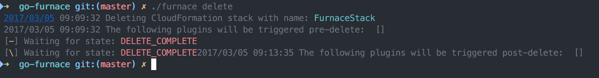
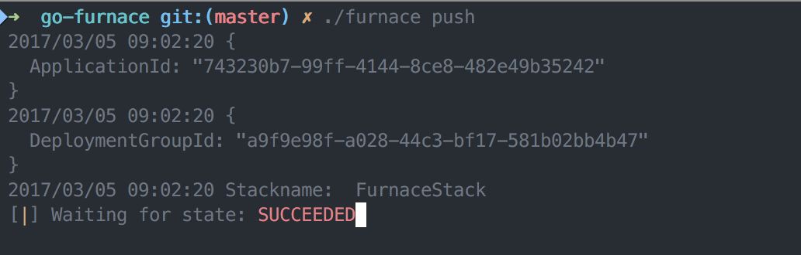
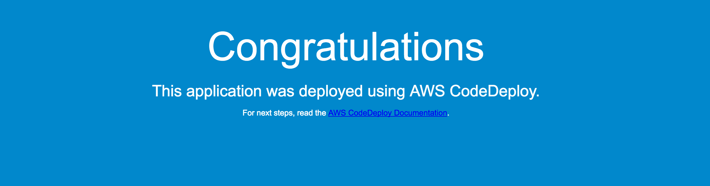

# AWS

### CloudFormation

[CloudFormation](https://aws.amazon.com/cloudformation/) as stated in the AWS documentation is an
> ...easy way to create and manage a collection of related AWS resources, provisioning and updating them in an orderly and predictable fashion.

Meaning, that via a template file it is possible to provide a description of the environment we would like to launch
are application into. How many server we would like to have? Load Balancing, and Auto Scaling setup. Own, isolated
network with VPCs. CloudFormation brings all these elements together into a bundler project called a `Stack`.
This stack can be created, updated, deleted and queried for various information.

This is what `Furnace` aims to abstract in order to provide a very easy interface to work with complex architecture.

### CodeDeploy

[CodeDeploy](http://docs.aws.amazon.com/codedeploy/latest/userguide/welcome.html), as the documentation states
> ...coordinates application deployments to Amazon EC2 instances

In short, once the stack is up, we would like to deploy our application to the stack for usage. CodeDeploy takes care of that.
We don't have to scp something to our instances, we don't have to care if an instance goes away, or if we would like to have
a copy of that same instance. CodeDeploy can be integrated with various other services, so once we described how to deploy
our application, we never have to worry about it again. A simple `furnace push` will install our app to every instance that
the `Stack` manages.

Don't forget to install the CodeDeploy agent to your instances for the CodeDeploy to work. For this, see an example in the
provided template.

## Go

The decision to use [Go](https://golang.org/) for this project came very easy considering the many benefits Go provides when
handling APIs and async requests. Downloading massive files from S3 in threads, or starting many services at once is a breeze.
Go also provides a single binary which is easy to put on the execution path and use `Furnace` from any location.

Go has ample libraries which come to aid with AWS and their own Go SDK is pretty mature and stable.

## Usage

### Make

This project is using a `Makefile` for it's build processes. The following commands will create a binary and
run all tests:

```bash
make build test
```

`make install` will install the binary in your `$GOHOME\bin` path. Though the binary will be named `go-furnace`.

For other targets, please consult the Makefile.

### Configuration

Furnace uses convention for configuration and YAML. This works as follows.

Since furnace is a distributable binary, it looks for a configuration called `.teststack.furnace` in the current running
directory. If it fails to find one, it will go up one level and search there, until it can't go any more up. It will leave
out `\` for searching. This is achieved by simply running `furnace-aws create teststack`. Or `furnace-aws status teststack`.
If the file doesn't exists, furnace will throw an error.

The parameter is optional. If not provided, furnace will look for it's default configuration files under `~/.config/go-furnace`.

The `.teststack.furnace` file contains a single entry, looking like this:

```bash
stacks/aws_config.yaml
```

This entry tells Furnace where to look for the given stack's configuration yaml file.
The configuration file for AWS looks like this:

```yaml
main:
  stackname: FurnaceStack
  spinner: 1
  plugins:
    plugin_path: "./plugins"
aws:
  code_deploy_role: CodeDeployServiceRole
  region: us-east-1
  template_name: cloud_formation.template
  app_name: furnace_app
  code_deploy:
    # Only needed in case S3 is used for code deployment
    code_deploy_s3_bucket: furnace_code_bucket
    # The name of the zip file in case it's on a bucket
    code_deploy_s3_key: furnace_deploy_app
    # In case a Git Repository is used for the application, define these two settings
    git_account: Skarlso/furnace-codedeploy-app
    git_revision: b89451234...
```

The configuration file for GCP looks like this:

```yaml
main:
  project_name: test-123
  spinner: 1
gcp:
  template_name: google_template.yaml
  stack_name: test2-stack
```

Notice that the name of the stack template file does not contain a directory. The stack template file must be located next to configuration file.

CodeDeploy further requires an IAM policy on the current user in order to be able to handle ASG and deploying to the EC2 instances. For this, a regular IAM role can be created from the AWS console. The name of the IAM profile can be configured later when pushing, if that is not set, the default is used which is `CodeDeployServiceRole`. This role can also be created via the CloudFormation stack template.

This setup allows for multiple stacks for a single project as long as the corresponding `.furnace` file exists; giving much more flexibility to the user.

### AWS Commands

Furnace provides the following commands (which you can check by running `./furnace`):

```bash
❯ ./furnace-aws help
delete custom-config               Delete a stack
push custom-config [-s3]           Push to stack
delete-application custom-config   Deletes an Application
update custom-config               Update a stack
status custom-config               Status of a stack.
create custom-config                  Create a stack
help [command]                     Display this help or a command specific help
```

Create and Delete will wait for the these actions to complete via a Waiter function. The waiters spinner type
can be set via the env property `FURNACE_SPINNER`. This is optional. The following spinners are available:

```go
// Spinners is a collection os spinner types
var Spinners = []string{`←↖↑↗→↘↓↙`,
	`▁▃▄▅▆▇█▇▆▅▄▃`,
	`┤┘┴└├┌┬┐`,
	`◰◳◲◱`,
	`◴◷◶◵`,
	`◐◓◑◒`,
	`⣾⣽⣻⢿⡿⣟⣯⣷`,
	`|/-\`}
```

The spinner defaults to `|/-\` which is # 7.

#### create

This will create the whole stack via the configuration provided under templates.


As you can see, furnace will ask for the parameters that reside in a template. If default is desired, simply
hit enter to continue using the default value.

#### delete

Deletes the whole stack complete with everything attached to the stack expect for the CodeDeploy application.



#### push

This is the command to get your application to be deployed onto all of your configured instances. This works via
two things. AutoScaling groups provided by the CloudFormation stack plus Tags that are put onto the instances called
`fu_stage`.



Push works with two revision locations.

##### GitHub

The default for a push is to locate a sample application on Github which will then be deployed.

##### S3

To use S3 for deployment, push needs an additional flag like this: `furnace-aws push --s3`.

Bucket is a unique bucket which is used to store a zipped version of the application. The key is the name of the object.
Access to the bucket needs to be defined in the CloudFormation template via an IAM Role. A sample is provided in the
template under the `templates` folder.

#### delete-application

Will delete the application and the deployment group completely.

#### successful push

If you are using the provided example and everything works, you should see the following output once you visit the
url provided by the load balancer.



#### status

The status command displays information about the stack.


#### update

Update uses a ChangeSet in order to see what the applied update will change. If the desired change is
needed it can be accepted with a simple `y/N` choice. If chosen `N` the change will not be applied.

## Configuration Management

Any kind of Configuration Management needs to be implemented by the application which is deployed.

That means that changes are applied to the `appspec.yml` file and the structure of the application itself.

For further examples checkout the AWS CodeDeploy example: [AwsLabs](https://github.com/awslabs/aws-codedeploy-samples).

## Testing

Testing the project for development is simply by executing `make test`.